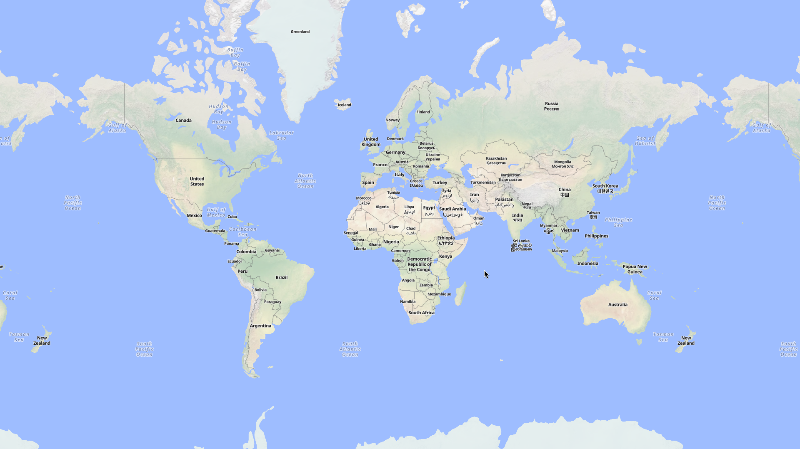
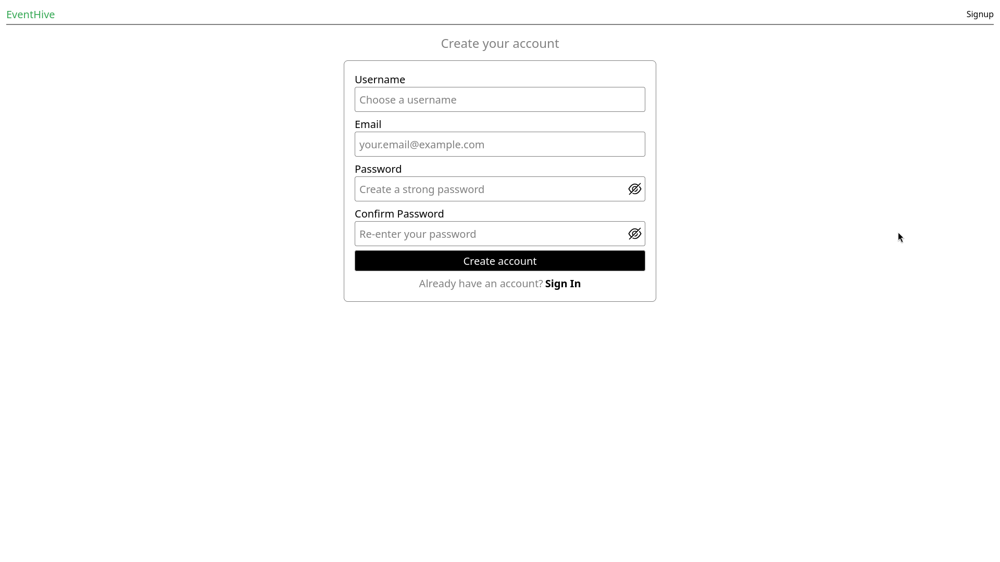

# EventHive



EventHive is a full-stack web application that allows users to create, discover, and attend events. It integrates authentication, and interactive maps using MapLibre to provide a seamless event exploration experience.

## 🚀 Features

- 🔐 Secure authentication (JWT + refresh tokens)
- 🗺 Interactive event location map (MapLibre)
- 📝 Create events
- 👥 Attend / un-attend events
- ✅ Form validation

---

## 🧱 Tech Stack

### Frontend

- React / Next.js
- Zustand (state management)
- Tailwind CSS (if used)
- MapLibre GL

### Backend

- Golang / Gin Framework
- REST API architecture
- JWT authentication

### Database

- PostgreSQL

### Tools

- Git & GitHub
- Golang Migrate

---

## 🗺 How the Map Works

EventHive uses MapLibre GL to render interactive maps.
Each event contains geolocation coordinates stored in the database.
Events are displayed as markers, allowing users to visually explore nearby activities.

---

## 🔐 Authentication Flow

- User logs in via credentials
- Server issues:
    - Access token (short-lived)
    - Refresh token (HTTP-only cookie)

---

## 📦 Setup

### clone the repo

```bash
git clone https://github.com/Yusufdot101/event-hive.git
cd event-hive
```

### setup the database

1. create the database
2. apply the migrations with;

```
migrate -path event-hive/backend/db/migrations/ -database "postgresql://...?sslmode=disable" up
```

### setup the frontend

```
cd frontend
npm install
npm run dev
```

### setup the backend

```
cd ../backend
go mod tidy
air
```

---

## 📄 License

MIT
